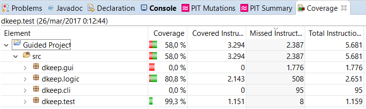

# FEUP_LPOO
Repository for the course "Laboratório de Programação Orientada por Objectos" (EIC0111) of the second semester of the second year of MIEIC in FEUP.

In this repository there are the 2 practical assignments of this course in the lective year of 2016/2017.
-----------> (So far only 1)

The following pictures are from the guided project's tests.

Credits:
 * Mário Gustavo Gomes Rosas de Azevedo Fernandes - up201201705 - ec12143@fe.up.pt
 * Nelson Filipe Barreto Almeida - up201505394 - up201505394@fe.up.pt
