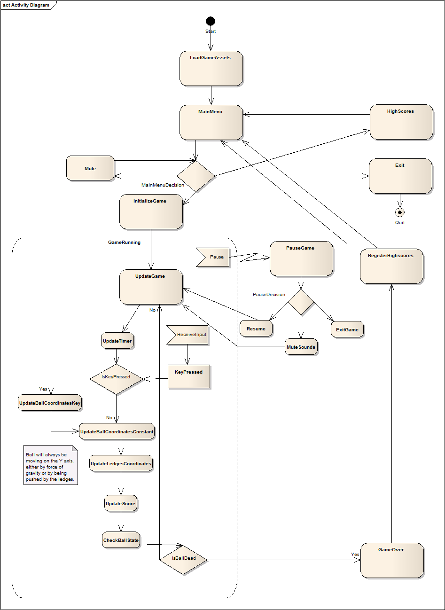
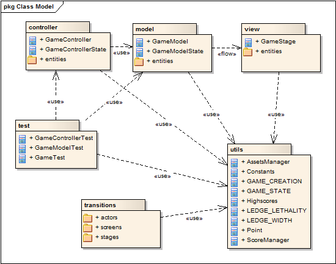
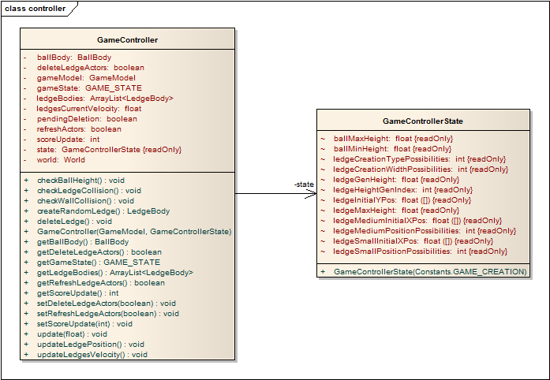
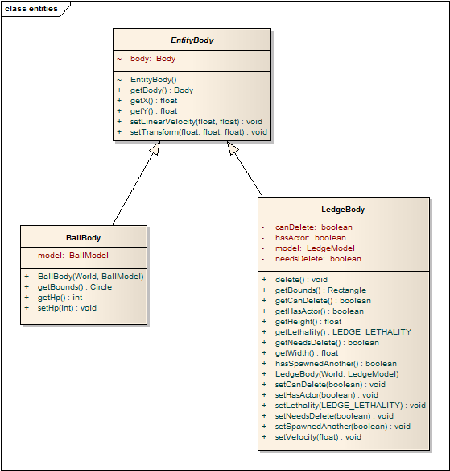

# BubbleRunner

On this section of the repository all of the information regarding the second project is presented.

This project's goal is to develop a JAVA program or software system, conveniently tested and documented, while applying Object-Oriented Design and Programming techniques. The final product is a game which uses libGDX framework and will implement physics and mobile components.

The game is an endless runner like game in which our protagonist goal is to descend the most distance he can, while avoiding traps and the continuously descending spikes.

To implement this game it was decided to use the following package diagram along with each class diagram:

Fig1 - Package diagram.

On this diagram, the way the packages will interact with eachother can be seen.

Fig2 - Logic package diagram.

On this package, all of the game's logic will be present. In libGDX, there is a World with 3 different Screens (Menu, Highscores and Game), the Game Screen will have 2 Scenes (running and paused), the running Scene will have the HUD Scene (from GUI package) aswel as Actors (Ball and Ledges). These Actors will also have a Body to process collisions.

Fig3 - GUI package diagram.

On this package, all of the games's graphics will be present. In libGDX the class GraphicsManager will be an AssetManager. The HUD class is the buttons, score and timer layer and the GameGraphics is the game layer itself. If a logic element wishes to use a certain sprite, it'll use a function similar to the following: "this.sprite = GraphicsManager.getGameGraphics().getBallSprite();" or "this.sprite = GraphicsManager.getHUD().getLeftButtonSprite();". The package itself could be divided into two different packages (the existing one and another one for the HUD) but as a group we find it that it is not necessary to do it.

Fig4 - Sound package diagram.

On this package, all of the games's sound will be present. In libGDX the class SoundManager will be an AssetManager.

Fig5 - Tests package diagram.

On this package, all of the games's tests will be present; the following list contains the tests that are planned to implement (can suffer alterations during the game implementation):

**Basic tests**
* Start the game and check for "running" state.
* Start the game, wait some time, check for "over" state.
* Start the game, simulate direction key pressed, check for ball's coordinates. (repeat for opposite direction)
* Start the game, simulate jump key pressed, wait some time, check for ball's coordinates, wait some time, check for ball's coordinates again.
**Advanced tests (movement + event triggers)**
* Start the game with ledge's velocity at 0, wait some time, check for "running" state.
* Start the game with ledge's velocity at 0, move ball left X seconds, check for ball position and updated score; if nothing changed, move right Y seconds a check again for ball position and updated score; repeat the test some times and assert that all came true. (this will test gravity and if there is no probability of a ledge being created wrongfully).
* Start the game, move ball left X seconds, wait Y seconds (enough so that the first ledge reaches spikes) check for positive updated score, updated timer, updated ledge velocity; repeat if failed until success or timeout.

The following diagram is an activity diagram explaining how the game will function from start to finish, and all of the available options a user can do and their influence.

Fig6 - Activity diagram.

The diagram is self-explanatory, but an important aspect to refer is that the game will have a few states: "starting", "running", "over" and "paused".

In terms of design patterns the game can use the following patterns:
* Singleton which can be used for the application instance, SoundManager and GraphicsManager class so that it is assured that only one element of these is created. Singleton should be used on elements which you only want one instance on the entire lifetime of the program.
* State in the Game and Ball class, as referred before, will be implemented to deal with the continuous changes to the game. Every "update" cycle will start by analyzing which state the game is in as well as having to deal with different Ball state (ex: "alive", "jumping", "dead").
* Template on "Game" (or possible a "GameManager") class, although a user will not be able to choose maps, the code will be generic enough so that that functionality can be implemented in the future, besides having an extremely easier code to read for bug fixing.
* Flyweight, on the Ledge class, which will be used to create multiple ledges and destroy them once their coordinates reach a certain Y. This pattern will make it so that only a few ledges (about 6 "template" ledges) are created but used in multiple instances. Prototype could be used here but flyweight will make it so the number of ledges are fixed and created only when the game starts.
* Facade which is implemented on a lot of the libGDX functionalities such as listener classes which provide easy to use functions that do multiple complex actions.

The following images are the mockups of the project:

   

Fig7,8,9,10 - Menu, highscores, paused menu and gameplay mockup

This last figure shows a red ball (the protagonist), ledges (which can be either normal or spiked) and spikes at the top (which continuously descend at a certain speed which increases the more the game prolongs).
Ideally the user will be able to move the ball left and right aswel as making it jump.

# BubbleRunner - RELEASE

This section contains the specifications of the final product, the updated images, uml diagram's and an all around report about the making of this project.

  * Instalation
  
To install this setup game, simply have a smartphone with android operating system and install one of the apk's which are on the "WorkingBuilds" directory. Notice that to install the debug apk, the device's depuration system needs to be active.

  * Development
  
  During the development of this project, a lot of studying and planning had to be made in order to understand how a mobile game was structured and how LIBGdx works. The game was made solely using the incremental method. The first step was to have the game running and the development was progressed by firstly, creating a ball and a ledge, then by trying to make them move, then by generating dynamic ledges, and to finalize the game another ledge type (the spiked ledge) was added. Only after the game logic was fully created, the huge refactor of the code happened of changing the whole code's structure onto an MVC model. The game was completly seperate into the Model-View-Controller method and the only aid LIBGdx is providing is on the shapes, Dynamic vs. Kinematic bodies, the world updates and the whole view module, leaving the Model and Controller modules almost completly LIBGdx-free.
  
  At first, the game was divided onto 4 packages: Screens, Stages, Actors, Utils. This structure was heavily dependant on LIBGdx and very generic, making the developers not even know which variables they were supposed to use. As for example, the ball protagonist had actor coordinates, body coordinates and texture coordinates while only the body coordinates are actually needed.
  
  At the end, the game is divided onto 3 main packages, excluding some complementary ones: Model, View and Controller. The model represents the basic model of the objects on the game such as their actual positions, the ball's hp, the ledge's lethaltiy etc. The controller uses an initial game model and controlls everything that are physics, updating the whole game with an update cycle. The view model uses a new game controller and simply maps textures onto the object's bodies coordinates; it also handles the user's controls and updates the player's score.
  
  The game itself is fully unit-testable (even all of the collisions!) and could even be played on a console if some changes were made to the user's controls (since on the real game, they are directional arrow images which the user can push).
  
  * UML Diagrams
  
  The following images are the updated package and class diagrams. The sequence uml diagram is left unchanged since the game follows it.
  
  
  
  Fig11 - Release Package Diagram
  
     
  
  Fig12,13 - Release Controller Diagrams
    
  
   
    Fig14,15 - Release Models Diagrams
   
  
       
   Fig16,17 - Release Views Diagrams
       
   
   
   Fig18,19,20 - Release Transitions Diagrams
   
   
   
   Fig21 - Release Utils Diagram
  
  
  
  Fig22 - Release Test Diagram
  
  * Difficulties and lessons learned
  
  Making a mobile game, besides being an extremly fun experience, it was very challenging. The main difficulty throughout the project was how to deal with LIBGdx since this was the first experience with it that the group had. The second and biggest difficulty was refactoring the game to have an MVC model. 
  
  LIBGdx as an engine provides many abstractions such as actors which can easily be extended, providing the programmer a much simpler and faster way to implement their code. The flaws of using this method, besides making the game not unit-testable, are quite a few if the programmer is not fully aware of how the engine works. Nevertheless, the MVC model is far from not having flaws since it contains redundancies, and often a lot a of lazy classes especially on the model side.
  
  A third difficulty was mapping the textures and fixing visual bugs such has sometimes forgetting to convert from "meters" to pixels.

  *  Overall work
  
  Both members had a 50% contribution to the project, Mario having a more active input on the game logic and Nelson dealing more with the visual side of the game and the whole time spent onto the whole project was around 90 hours.
  
  *  User manual
  
  The aim of the game is to reach as far as the user can. The player has to use the directional buttons to move the ball left or right while the ball is continuously falling. The ball can't go too far or stay behind or else it will get destroyed by spikes. New random ledges will be created from time to time to help the player navigate but watch out as these ledges can have spikes themselves or can even push the player to the upper spikes! After the game is done and if the player has done a good score, he will be able to register his name onto the highscores.
