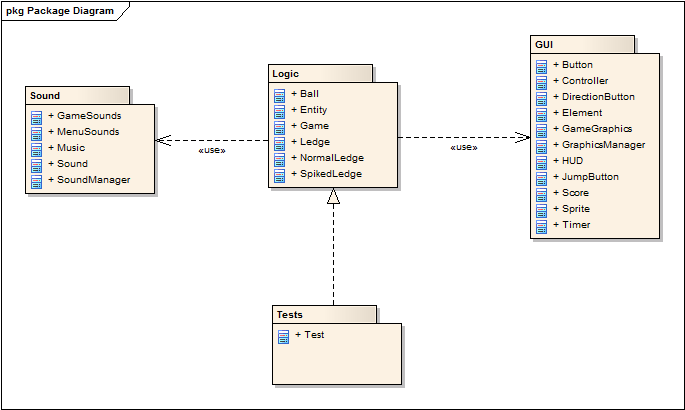
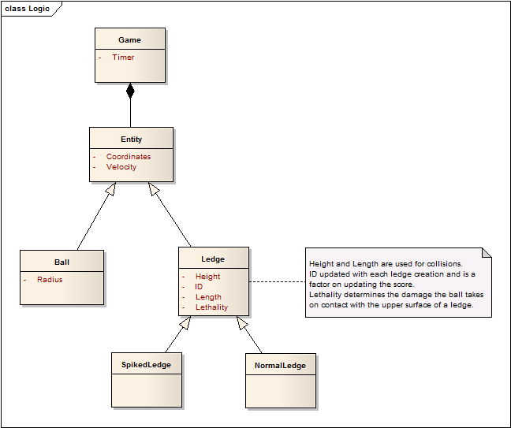
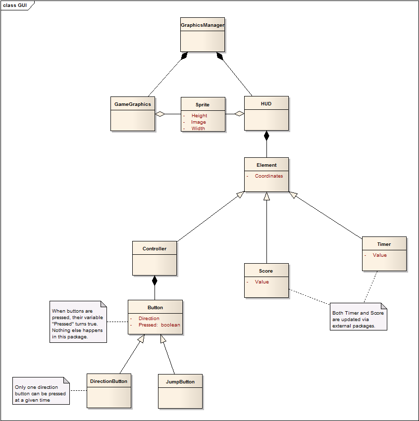
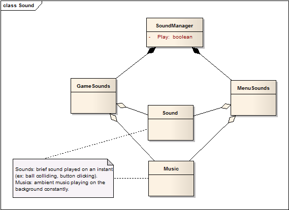
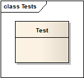
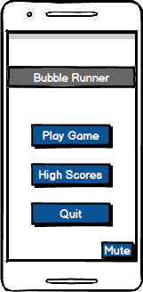
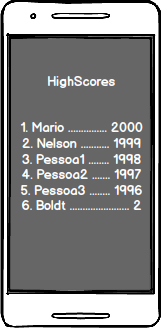
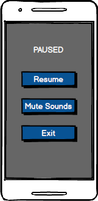
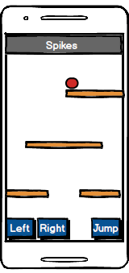

# BubbleRunner

On this section of the repository all of the information regarding the second project is presented.

This project's goal is to develop a JAVA program or software system, conveniently tested and documented, while applying Object-Oriented Design and Programming techniques. The final product is a game which uses libGDX framework and will implement physics and mobile components.

The game is an endless runner like game in which our protagonist goal is to descend the most distance he can, while avoiding traps and the continuously descending spikes.

To implement this game it was decided to use the following package diagram along with each class diagram:

Fig1 - Package diagram.

On this diagram, the way the packages will interact with eachother can be seen.

Fig2 - Logic package diagram.

On this package, all of the game's logic will be present. In libGDX, there is a World with 3 different Screens (Menu, Highscores and Game), the Game Screen will have 2 Scenes (running and paused), the running Scene will have the HUD Scene (from GUI package) aswel as Actors (Ball and Ledges). These Actors will also have a Body to process collisions.

Fig3 - GUI package diagram.

On this package, all of the games's graphics will be present. In libGDX the class GraphicsManager will be an AssetManager. The HUD class is the buttons, score and timer layer and the GameGraphics is the game layer itself. If a logic element wishes to use a certain sprite, it'll use a function similar to the following: "this.sprite = GraphicsManager.getGameGraphics().getBallSprite();" or "this.sprite = GraphicsManager.getHUD().getLeftButtonSprite();". The package itself could be divided into two different packages (the existing one and another one for the HUD) but as a group we find it that it is not necessary to do it.

Fig4 - Sound package diagram.

On this package, all of the games's sound will be present. In libGDX the class SoundManager will be an AssetManager.

Fig5 - Tests package diagram.

On this package, all of the games's tests will be present; the following list contains the tests that are planned to implement (can suffer alterations during the game implementation):

**Basic tests**
* Start the game and check for "running" state.
* Start the game, wait some time, check for "over" state.
* Start the game, simulate direction key pressed, check for ball's coordinates. (repeat for opposite direction)
* Start the game, simulate jump key pressed, wait some time, check for ball's coordinates, wait some time, check for ball's coordinates again.
**Advanced tests (movement + event triggers)**
* Start the game with ledge's velocity at 0, wait some time, check for "running" state.
* Start the game with ledge's velocity at 0, move ball left X seconds, check for ball position and updated score; if nothing changed, move right Y seconds a check again for ball position and updated score; repeat the test some times and assert that all came true. (this will test gravity and if there is no probability of a ledge being created wrongfully).
* Start the game, move ball left X seconds, wait Y seconds (enough so that the first ledge reaches spikes) check for positive updated score, updated timer, updated ledge velocity; repeat if failed until success or timeout.

The following images are the mockups of the project:

   

Fig1,2,3,4 - Menu, highscores, paused menu and gameplay mockup

This last figure shows a red ball (the protagonist), ledges (which can be either normal or spiked) and spikes at the top (which continuously descend at a certain speed which increases the more the game prolongs, up to a cap).
Ideally the user will be able to move the ball left and right aswel as making it jump.
